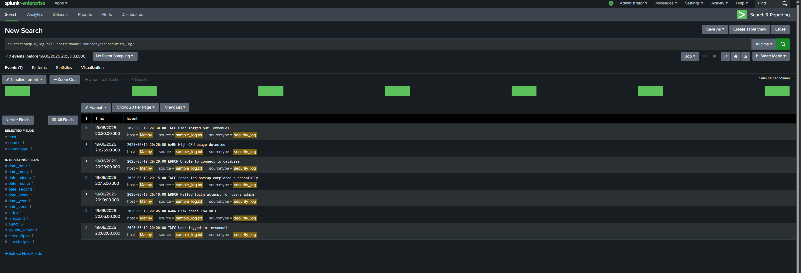

# Splunk Windows Log Analysis

## 📌 Project Overview
This project demonstrates how to ingest and analyze Windows event logs using Splunk. As a cybersecurity recent graduate, gaining hands-on experience with log management and analysis tools like Splunk is essential for understanding system security, monitoring, and incident response.

## 🛠 What is Splunk?
Splunk is a powerful platform used for searching, monitoring, and analyzing machine-generated data via a web-style interface. It is widely adopted in cybersecurity operations to gain insights from logs, detect threats, and improve an organization’s overall security posture.

## 📂 Project Details
- **Logs used:**  
  - Windows Event Logs exported as `.csv`  
  - Sample custom logs in plain text format
- **Data ingestion:**  
  - Logs were uploaded to Splunk using the web interface (Data Inputs)
  - Indexed with appropriate source types (e.g., `csv`, `security_log`)
- **Analysis performed:**  
  - Basic search queries filtering by event type, severity, and Event ID
  - Identified key events like login attempts, errors, and system changes

## 💡 Why This Matters
Windows event logs contain critical information about user activity, system behavior, and potential security incidents. Knowing how to interpret and analyze these logs is a vital skill for cybersecurity professionals to detect anomalies, investigate incidents, and ensure compliance.

## ▶️ How to Run This Project
1. **Export** Windows event logs using Event Viewer or use the provided `sample_log.txt`.
2. **Upload** the logs to Splunk via:  
   `Settings > Add Data > Upload`  
3. **Assign** a source type (e.g., `csv`, `security_log`) during ingestion.
4. **Run** search queries in the Splunk Search & Reporting app.

## Screenshot

Here’s a snapshot of the logs visualized in Splunk:



## 🔍 Sample Searches
```spl
index=main source="sample_log.txt" "User logged in"
index=main source="sample_log.txt" ERROR
index=main source="security_log.csv" EventID=1038
index=main source="security_log.csv" EventID=7040
